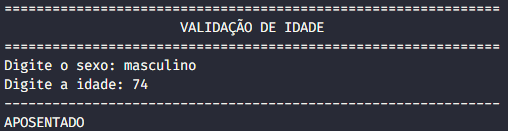
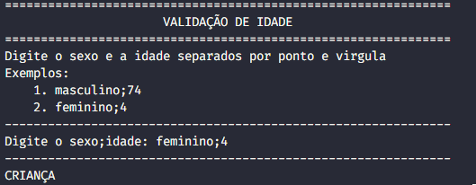

# Exercícios programação iDtrust - Victor Fiuza

 Vaga: Analista de Implantação Junior

---

## 1 - Monte a estrutura condicional if/else para as regras abaixo e no final o que será mostrado para cada valores:

Para este exercício, foram criadas duas versões: uma em que a pessoa deve escrever o sexo e, em seguida, separado por um ponto e vírgula (;), a idade; e outra versão em que a pessoa deve escrever o sexo primeiro, pressionar enter e, em seguida, escrever a idade.

### Regras:
- homens a partir de 65 anos, escrever APOSENTADO;
- mulheres a partir de 60 anos, escrever APOSENTADA;
- pessoas entre 13 que 18 anos, escrever ADOLESCENTE;
- pessoas menores que 13 anos, escrever CRIANÇAS;
- todos os outros, escrever ADULTO;

*`1-if-else.py`* 


 
 *`1-if-else-v2.py`* 



---

## 2 - De acordo com o algoritmo a seguir, escolha uma das alternativas abaixo.
```python
contador :=  3
soma  := 57
for (contador <= 10 ) {
	if (contador < 5 || contador == 8 ) {
		soma := soma - contador
    } else {
            soma = soma + contador
    }
	contador++
} 
print("O valor da soma é " + soma)
```

**c) O valor da soma é 79**